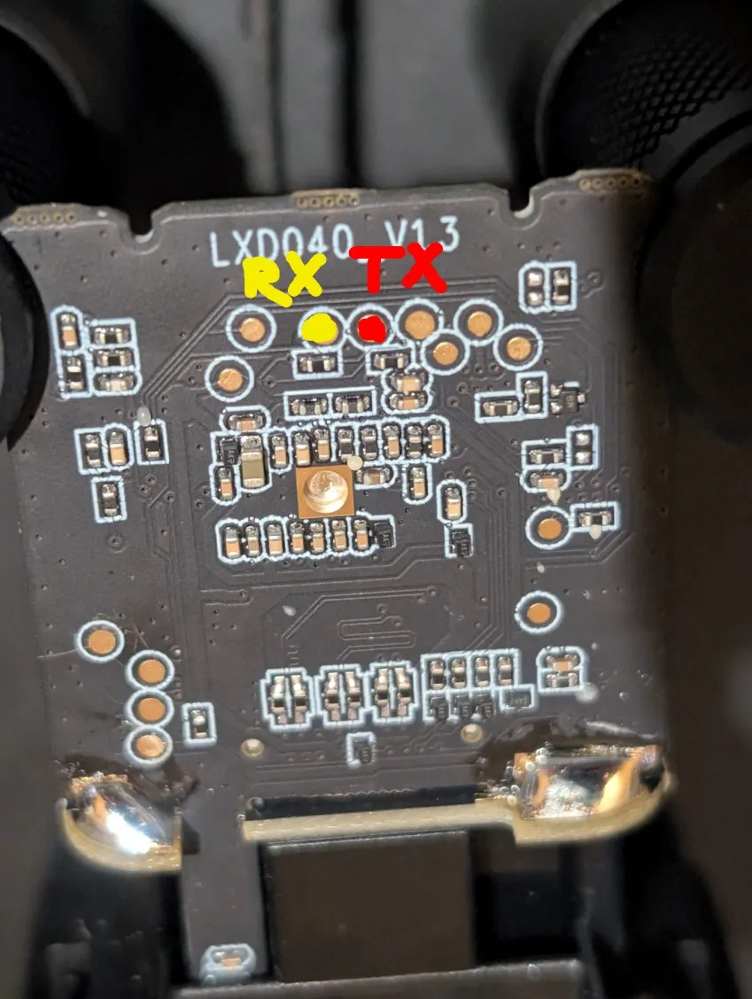
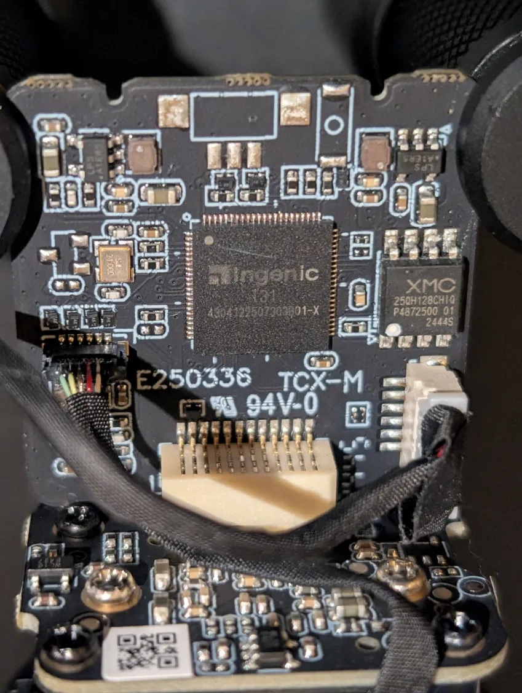
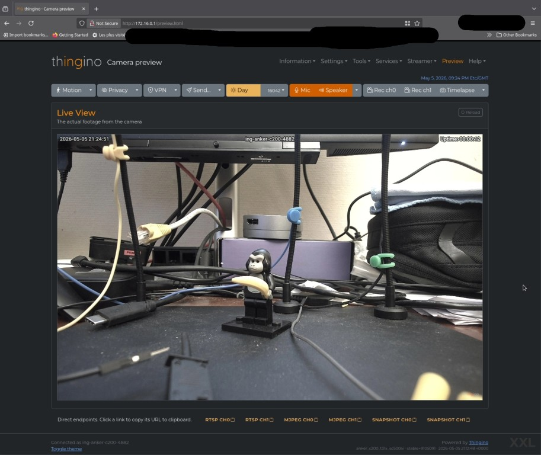

# anker_c200

The idea is to gain control of the camera and install thingino on it.

I had already gained knowledge on how the camera works by opening it, dumping the complete firmware, and getting a remote shell.

But I wanted to find a method to do so without touching it. That front glass is very brittle...

What I knew was that an Android Debug Bridge (ADB) could be opened. And to open it, you had to modify a configuration file.

What I thought then was, if I could get an official OTA file, if it could be modified and flashed to the camera, then I could activate ADB.

But my camera was already at the latest firmware version and the AnkerWorks application would not let me get the OTA.


## general info

If you still want to open the camera, here is what you can expect to see:



You can get a serial console from those marked pads (115200, 8 bit, 1 stop bit, no parity). No password asked, root.




## Getting the OTA image

This AnkerWorks windows PC application allows to set up the camera, and update it.

The idea here is to obtain an OTA file for the camera by tricking AnkerWorks into thinking the camera needs it.

AnkerWorks is an Electron app, thus can be launched with the debugging tools attached:

```bash
C:\Users\m4mmon\AppData\Local\Programs\AnkerWork\AnkerWork.exe --remote-debugging-port=9222
```

Then open a browser and go to http://localhost:9222/

Select the first instance of Anker Works, go to the "Sources" and under the "no domain" category, look for the "preload.js" embedded into the app.asar file.

Open it and "pretty print" it, because it is minified.


AnkerWorks gets to know if a device needs an update by sending a payload to a server with the device details like the product code and the firmware version.

So what I did was set a breakpoint in the method "manuallyRequestNewVersion". In AnkerWorks, I went to the "Firmware Info" part and clicked the "Check for Updates" button.

The breakpoint was reached, and there I could access the object representing the camera and alter the version member by issuing the following in the debugging console:
```
this.version = "0.1"
```

I then just had to look at the responses, the server immediately provided the complete URL to the OTA update :) on some amazonaws server.

At the time of writing, the filename is "1683172794421534_Kiva_anker_update_package_c200_7.5_230423171038.img".

You can also find the requests and responses in the file "C:\Users\m4mmon\AppData\Roaming\AnkerWork\logs\renderer.log".

So, I downloaded it for further analysis, and also let AnkerWorks perform the update, which went perfectly fine.

Note that it is only 12MB, it does not contain the bootloader and some other parts. It does not replace a complete backup of the firmware.


## flashing the OTA

Here I will not enter into too many details. What happened is that I used an LLM to assist me reconstructing a flashing tool for the camera.

When using AnkerWorks, a lot of info is written into log files located in C:\Users\m4mmon\AppData\Roaming\AnkerWork\logs.
The most important one is awdevice.log.

It tells everything about what happens when the camera is updated. I fed that to the LLM.

Without too many details, the flashing process is like:
- send a special UVC command to the camera to make it enter into update mode,
- the camera in update mode disconnects as an UVC device (the webcam) and declares itself as a serial port,
- the AnkerWorks app waits for the serial port to be present,
- the AnkerWorks app sends information about the OTA file, its size, checksum
- the AnkerWorks app sends chunks of the OTA with a temporary header indicating the checksum of the chunk,
- once every 2000 chunks, the camera sends an "ACK" message containing the index of the last received chunk, AnkerWorks waits for that and checks it,
- when the last chunk has been sent, the camera will send an ACK with a different byte somewhere, kind of indicating it is done.

Once the transfer is done, *alea jacta est*, the camera reboots itself and the bootloader applies the OTA.
Hopefully at the end, the updated camera restart, declares itself as usual as an UVC device, and works again.

So with the help of the LLM a python script was written to handle all this.

**I tried to make it as safe as possible, I have used it myself numerous times, but cannot guarantee it will not brick your camera.**

The script:
- checks the input firmware file ("magic", CRC in header),
- detects the camera,
- sends a command to read its current firmware version,
- enumerates the current serial devices,
- sends the special UVC command to make the camera switch to update mode,
- enumerates the serial ports and checks if a new one has popped,
- sends the firmware as described, a first packet to describe it, then the chunks, the occasional ACKs and the final one.

You can find it [here](scripts/AnkerC200_flashtool.py).
**Use at your own risk**

I tested it with the downloaded OTA file at first. Success :)

## patching the OTA

Thanks Anker, the OTA is not encrypted or anything. It can be extracted and rebuilt, exactly what we need to do.

You can find the script [here](scripts/build_adb_firmware.py).

It extracts and patches some files:
- config/uvc.config: I am not sure about that one. It looks like a default configuration file, and might be used if resetting the camera. Really not sure, in doubt, I decided to make the change there also.
- init/app_init.sh: this script is executed at camera startup. It modifies the uvc.config (not the previous one, but the one actually used by the running system) in order to activate the Android Debug Bridge.
 
Then the script repacks a new OTA file that can be flashed to the camera with the AnkerC200_flashtool.py script.

Once flashed, you can get a root shell by issuing:
```
$ adb shell
[root@Ingenic-uc1_1:modules]# uname -a
Linux Ingenic-uc1_1 3.10.14__isvp_swan_1.0__ #1 PREEMPT Sun Apr 23 17:09:25 CST 2023 mips GNU/Linux
[root@Ingenic-uc1_1:modules]# ps w
  PID USER       VSZ STAT COMMAND
    1 root      1824 S    init
    2 root         0 SW   [kthreadd]
    3 root         0 SW   [ksoftirqd/0]
    4 root         0 SW   [kworker/0:0]
    5 root         0 SW<  [kworker/0:0H]
    6 root         0 SW   [kworker/u2:0]
    7 root         0 SW   [rcu_preempt]
    8 root         0 SW   [rcu_bh]
    9 root         0 SW   [rcu_sched]
   10 root         0 SW   [watchdog/0]
   11 root         0 SW<  [khelper]
   12 root         0 SW<  [writeback]
   13 root         0 SW<  [bioset]
   14 root         0 SW<  [kblockd]
   15 root         0 SW   [kworker/0:1]
   16 root         0 SW   [kswapd0]
   17 root         0 SW   [fsnotify_mark]
   18 root         0 SW<  [crypto]
   32 root         0 SW<  [deferwq]
   33 root         0 SW   [kworker/u2:1]
   45 root      1812 S    telnetd
   48 root         0 SWN  [jffs2_gcd_mtd2]
   50 root      1824 S    /sbin/getty -L console 115200 vt100
   52 root         0 SWN  [jffs2_gcd_mtd3]
   88 root         0 SW   [irq/37-isp-m0]
   90 root         0 SW   [irq/38-isp-w02]
  111 root      165m S    ucamera
  134 root         0 DW   [isp_fw_process]
  140 root     11484 S    hid_update
  143 root      3048 S    adbd
  147 root      1824 S    /bin/sh -l
  151 root      1816 R    ps w
```

## Building thingino

https://thingino.com/

https://github.com/themactep/thingino-firmware/

The camera is not supported yet, some stuff is missing.
As of today, there is no sound, and no autofocus (though focus can be manually set).

So there is an experimental profile, but you'll have to build an image yourself.

Follow the instructions to build a firmware on the thingino page or wiki.
Instead of issuing the "make" command, you want to:
```
GROUP=exp make
```
and select the "anker_c200_t31x_sc500ai".

Hopefully you'll get a file named "thingino-anker_c200_t31x_sc500ai.bin" at the end.

## backup the original firmware

I have not found a perfect way to do.

Here is what I would do.

First, backup as much as you can:
```bash
#!/bin/bash

for i in $(seq 0 3)
do
   adb shell dd if=/dev/mtd${i} of=/tmp/mtd${i}.bin
   adb pull /tmp/mtd${i}.bin
   adb shell rm /tmp/mtd${i}.bin
done
```

This will backup the mapped parts on the chip. However, this is incomplete, the last part, let's call it mtd4_ghost is not mapped, and I have not found a way to access it while the system is still usable (and the camera not opened).

This part contains a kernel that is booted when performing the OTA update. So in theory, the camera with the restored firmware would work with it, but there might be some problems if you try to flash it, be it with the AnkerWorks app or the script...

So...
Once you destroy the bootloader, when the camera reboots and enter into the USB-boot mode, perform a full dump as explained in the Thingino wiki.

You'll get a backup with an erased bootloader.

And finally, you can reconstruct something "complete" by:

```bash
cat mtd0.bin <(tail -c +32769 dump.bin) > full_backup.bin
```

I tested that, the backup worked, the camera rebooted fine, I could perform once again an update with the script.

But a little scary.


Another way would be to trust the stock firmware dump from [there](https://github.com/themactep/ipc-firmware/blob/master/anker_c200-t31x-sc500ai-stock.bin).

Extract "mtd4" from it:
```bash
dd if=anker_c200-t31x-sc500ai-stock.bin of=mtd4.bin bs=1 skip=$((0xC40000))
```

Perform the backup of the visible parts mtd0 to mtd3 as shown earlier, and combine them with that mtd4 and you have a full backup while the camera is still working.

Then once you decide to make the camera enter into USB-boot mode (by erasing mtd0), you still can get your own "mtd4" by using the read feature of the Ingenic cloner tool. It should be exactly the same.

## Installing thingino

There you have to take a leap of faith.

If the camera fails to boot, it enters into a special "USB-boot" mode, allowing to read or write the flash chip contents.

You can read everything about that [here](https://github.com/themactep/thingino-firmware/wiki/Ingenic-USB-Cloner).

**do a backup before**
So, the idea is to make the system unbootable. To do this, simply erase the bootloader. ***WARNING: this makes the camera unusable*** until you flash something back on it with the cloner tool. So, to erase the bootloader:
```
adb shell flash_eraseall /dev/mtd0
```
This was suggested by [gtxaspec](https://github.com/gtxaspec), thanks.

Reboot the camera, it should enter into cloner mode:

```bash
lsusb
...
Bus 003 Device 004: ID a108:c309 Ingenic Semiconductor Co.,Ltd à        USB Boot Device
...
```
Dump the flash (with an erased bootloader /dev/mtd0), and flash the firmware.

When done, the camera should show up as a network interface :

```bash
ip link
...
5: enx02ceca7b4881: <BROADCAST,MULTICAST,UP,LOWER_UP> mtu 1500 qdisc fq_codel state UP mode DEFAULT group default qlen 1000
    link/ether 02:ce:ca:7b:48:81 brd ff:ff:ff:ff:ff:ff
...
```

Issue a:
```bash
sudo ip addr add 172.16.0.2/24 dev <your interface>
```

And the camera should become reachable through ssh/web @172.16.0.1.




To set the focus, from ssh use the script "dw9714-ctrl".
In the screen shot, it was "dw9714-ctrl 65" (the lower the farther).


## Original firmware info

### serial output at boot

```
Serial init OK!jz_serial_init ok
pll_init:366
pll_cfg.pdiv = 10, pll_cfg.h2div = 5, pll_cfg.h0div = 5, pll_cfg.cdiv = 1, pll_cfg.l2div = 2
nf=116 nr = 1 od0 = 1 od1 = 2
cppcr is 07405100
CPM_CPAPCR 0740510d
nf=100 nr = 1 od0 = 1 od1 = 2
cppcr is 06405100
CPM_CPMPCR 0640510d
nf=96 nr = 1 od0 = 1 od1 = 2
cppcr is 06005100
CPM_CPVPCR 1200990d
cppcr 0x9a7b5510
apll_freq 1392000000
mpll_freq 1200000000
vpll_freq = 1152000000
ddr sel mpll, cpu sel apll
ddrfreq 600000000
cclk  1392000000
l2clk 696000000
h0clk 240000000
h2clk 240000000
pclk  120000000
sdram init start
REG_DDR_LMR: 00000210
REG_DDR_LMR: 00000310
REG_DDR_LMR: 00000110
REG_DDR_LMR, MR0: 00f73011
T31_0x5: 00000007
T31_0x15: 0000000c
T31_0x4: 00000000
T31_0x14: 00000002
INNO_TRAINING_CTRL 1: 00000000
INNO_TRAINING_CTRL 2: 000000a1
T31_cc: 00000003
INNO_TRAINING_CTRL 3: 000000a0
T31_118: 0000003c
T31_158: 0000003c
T31_190: 0000001f
T31_194: 0000001e
DDR PHY init OK
DDR Controller init
SDRAM init ok

spl_sfc_nor_load_kernel flash_flag=0xffffffff...

uImage size = [3321321]
OK
images->ep = 802c2790
[    0.000000] Initializing cgroup subsys cpu
[    0.000000] Initializing cgroup subsys cpuacct
[    0.000000] Linux version 3.10.14__isvp_swan_1.0__ (iotbuild@115892f10c38) (gcc version 4.7.2 (Ingenic r2.3.3 2016.12) ) #1 PREEMPT Sun Apr 23 17:11:07 CST 2023
[    0.000000] bootconsole [early0] enabled
[    0.000000] CPU0 RESET ERROR PC:3000A399
[    0.000000] CPU0 revision is: 00d00100 (Ingenic Xburst)
[    0.000000] FPU revision is: 00b70000
[    0.000000] CCLK:1392MHz L2CLK:696Mhz H0CLK:200MHz H2CLK:200Mhz PCLK:100Mhz
[    0.000000] Determined physical RAM map:
[    0.000000]  memory: 003a6000 @ 00010000 (usable)
[    0.000000]  memory: 0030a000 @ 003b6000 (usable after init)
[    0.135499] drivers/rtc/hctosys.c: unable to open rtc device (rtc0)
mdev is ok......

Ingenic-uc1_1 login: [    0.513536] dw9714-input 0-000c: misc_deregister is ok!
/media/uvc.attr exist
brgain:0348015a
Invalid config param: focus_trigger_value
[Ucamera]: ---ovo---warning: config 11--00000189--393

[Ucamera]: ---ovo---warning: config 1--ffffc7c0---14400

[Ucamera]: ---ovo---warning: config 2--ffffe3e0---7200

[Ucamera]: ---ovo---warning: config 3--0000005f--95

[Ucamera]: ---ovo---warning: config 4--00000000--0

[Ucamera]: ---ovo---warning: config 5--00000000--0

[Ucamera]: ---ovo---warning: config 6--00000000--0

[Ucamera]: ---ovo---warning: config 7--00000000--0

---ovo-----af--1---0--
[Ucamera]: ---ovo---warning: config 8--00000226--550

++++af value = 550 +++++
[Ucamera]: ---ovo---warning: config 9--0348015a--55050586

[Ucamera]: [INFO]: Video Start.

[Ucamera]: Antiflicker is 0

[Ucamera]: set PowerLine Freq failed:-1

[Ucamera]: failed to get sensor fps

[Ucamera]: Antiflicker is 1

[Ucamera]: set PowerLine Freq failed:-1

[Ucamera]: failed to get sensor fps

---- FPGA board is ready ----
  Board UID : 30AB6E51
  Board HW ID : 72000460
  Board rev.  : 5DE5A975
  Board date  : 20190326
-----------------------------
warn: shm_init,53shm init already
auaglo_init, channel:2, rate:48000, ifsamples:1440, frame_size:5760
ovo-0-,init process!
mod_this:2,mod:2,angle:0
[Ucamera]: [INFO]: Audio Start.

[Ucamera]: gaudio unkonwn event:0

------RECORD  OFF------
------RECORD  OFF------
------RECORD  ON------
------RECORD  OFF------
set mic volume db:0x64 percent:90
set mic volume db:0x64 percent:90
------RECORD  ON------
------RECORD  OFF------
------RECORD  ON------
------RECORD  OFF------
------RECORD  ON------
------RECORD  OFF------
jdwp_service.c::jdwp_control_init():jdwp control socket started (6)
```

### dmesg (with adb activated)

```
[root@Ingenic-uc1_1:~]# dmesg
[    0.000000] Initializing cgroup subsys cpu
[    0.000000] Initializing cgroup subsys cpuacct
[    0.000000] Linux version 3.10.14__isvp_swan_1.0__ (iotbuild@115892f10c38) (gcc version 4.7.2 (Ingenic r2.3.3 2016.12) ) #1 PREEMPT Sun Apr 23 17:11:07 CST 2023
[    0.000000] bootconsole [early0] enabled
[    0.000000] CPU0 RESET ERROR PC:3000A399
[    0.000000] CPU0 revision is: 00d00100 (Ingenic Xburst)
[    0.000000] FPU revision is: 00b70000
[    0.000000] cgu_get_rate, parent = 1392000000, rate = 0, m = 0, n = 0, reg val = 0x081000ff
[    0.000000] cgu_get_rate, parent = 1392000000, rate = 0, m = 0, n = 0, reg val = 0x081000ff
[    0.000000] CCLK:1392MHz L2CLK:696Mhz H0CLK:200MHz H2CLK:200Mhz PCLK:100Mhz
[    0.000000] Determined physical RAM map:
[    0.000000]  memory: 003a6000 @ 00010000 (usable)
[    0.000000]  memory: 0030a000 @ 003b6000 (usable after init)
[    0.000000] User-defined physical RAM map:
[    0.000000]  memory: 04000000 @ 00000000 (usable)
[    0.000000] Initrd not found or empty - disabling initrd
[    0.000000] Zone ranges:
[    0.000000]   Normal   [mem 0x00000000-0x03ffffff]
[    0.000000] Movable zone start for each node
[    0.000000] Early memory node ranges
[    0.000000]   node   0: [mem 0x00000000-0x03ffffff]
[    0.000000] On node 0 totalpages: 16384
[    0.000000] free_area_init_node: node 0, pgdat 803b4490, node_mem_map 81000000
[    0.000000]   Normal zone: 128 pages used for memmap
[    0.000000]   Normal zone: 0 pages reserved
[    0.000000]   Normal zone: 16384 pages, LIFO batch:3
[    0.000000] Primary instruction cache 32kB, 8-way, VIPT, linesize 32 bytes.
[    0.000000] Primary data cache 32kB, 8-way, VIPT, no aliases, linesize 32 bytes
[    0.000000] pls check processor_id[0x00d00100],sc_jz not support!
[    0.000000] MIPS secondary cache 128kB, 8-way, linesize 32 bytes.
[    0.000000] pcpu-alloc: s0 r0 d32768 u32768 alloc=1*32768
[    0.000000] pcpu-alloc: [0] 0
[    0.000000] Built 1 zonelists in Zone order, mobility grouping off.  Total pages: 16256
[    0.000000] Kernel command line:  console=ttyS1,115200n8 mem=64M@0x0 rmem=64M@0x4000000 init=/linuxrc root=/dev/ram0 rw mtdparts=jz_sfc:32k(boot),4064k(kernel),8192k(appfs),256k(configfs) quiet
[    0.000000] PID hash table entries: 256 (order: -2, 1024 bytes)
[    0.000000] Dentry cache hash table entries: 8192 (order: 3, 32768 bytes)
[    0.000000] Inode-cache hash table entries: 4096 (order: 2, 16384 bytes)
[    0.000000] Memory: 57636k/65536k available (2793k kernel code, 7900k reserved, 940k data, 3112k init, 0k highmem)
[    0.000000] SLUB: HWalign=32, Order=0-3, MinObjects=0, CPUs=1, Nodes=1
[    0.000000] Preemptible hierarchical RCU implementation.
[    0.000000] NR_IRQS:358
[    0.000000] clockevents_config_and_register success.
[    0.000014] Calibrating delay loop... 1391.00 BogoMIPS (lpj=6955008)
[    0.090040] pid_max: default: 32768 minimum: 301
[    0.090224] Mount-cache hash table entries: 512
[    0.090631] Initializing cgroup subsys debug
[    0.090648] Initializing cgroup subsys freezer
[    0.092229] regulator-dummy: no parameters
[    0.092358] NET: Registered protocol family 16
[    0.093018] set gpio strength: 32-2
[    0.093027] set gpio strength: 33-2set gpio strength: 34-2
[    0.093037] set gpio strength: 35-2set gpio strength: 36-2
[    0.093045] set gpio strength: 37-2set gpio pull: 59-90
[    0.099448] bio: create slab <bio-0> at 0
[    0.100966] jz-dma jz-dma: JZ SoC DMA initialized
[    0.101169]  (null): set:249  hold:250 dev=100000000 h=500 l=500
[    0.101240] media: Linux media interface: v0.10
[    0.101278] Linux video capture interface: v2.00
[    0.101646] Switching to clocksource jz_clocksource
[    0.102068] dwc2 otg probe start
[    0.102092] jz-dwc2 jz-dwc2: cgu clk gate get error
[    0.102113] DWC IN DEVICE ONLY MODE
[    0.102739] dwc2 dwc2: Keep PHY ON
[    0.102748] dwc2 dwc2: Using Buffer DMA mode
[    0.102758] dwc2 dwc2: Core Release: 3.00a
[    0.102980] dwc2 dwc2: enter dwc2_gadget_plug_change:2595: plugin = 1 pullup_on = 0 suspend = 0
[    0.102989] dwc2 otg probe success
[    0.103114] NET: Registered protocol family 2
[    0.103590] TCP established hash table entries: 512 (order: 0, 4096 bytes)
[    0.103613] TCP bind hash table entries: 512 (order: -1, 2048 bytes)
[    0.103627] TCP: Hash tables configured (established 512 bind 512)
[    0.103674] TCP: reno registered
[    0.103684] UDP hash table entries: 256 (order: 0, 4096 bytes)
[    0.103702] UDP-Lite hash table entries: 256 (order: 0, 4096 bytes)
[    0.103890] NET: Registered protocol family 1
[    0.122775] freq_udelay_jiffys[0].max_num = 10
[    0.122786] cpufreq  udelay  loops_per_jiffy
[    0.122792] 12000     59956   59956
[    0.122797] 24000     119913  119913
[    0.122802] 60000     299784  299784
[    0.122808] 120000    599569  599569
[    0.122814] 200000    999282  999282
[    0.122819] 300000    1498924         1498924
[    0.122824] 600000    2997848         2997848
[    0.122830] 792000    3957159         3957159
[    0.122836] 1008000   5036385         5036385
[    0.122842] 1200000   5995696         5995696
[    0.126343] squashfs: version 4.0 (2009/01/31) Phillip Lougher
[    0.126483] jffs2: version 2.2. © 2001-2006 Red Hat, Inc.
[    0.126735] msgmni has been set to 112
[    0.127712] io scheduler noop registered
[    0.127746] io scheduler cfq registered (default)
[    0.128846] jz-uart.1: ttyS1 at MMIO 0x10031000 (irq = 58) is a uart1
[    0.129928] console [ttyS1] enabled, bootconsole disabled
[    0.130324] brd: module loaded
[    0.131603] loop: module loaded
[    0.132408] zram: Created 2 device(s) ...
[    0.132470] logger: created 256K log 'log_main'
[    0.132860] jz TCU driver register completed
[    0.133146] the id code = 204018, the flash name is XM25QH128C
[    0.133156] JZ SFC Controller for SFC channel 0 driver register
[    0.133174] 4 cmdlinepart partitions found on MTD device jz_sfc
[    0.133180] Creating 4 MTD partitions on "jz_sfc":
[    0.133188] 0x000000000000-0x000000008000 : "boot"
[    0.133593] 0x000000008000-0x000000400000 : "kernel"
[    0.133970] 0x000000400000-0x000000c00000 : "appfs"
[    0.134327] 0x000000c00000-0x000000c40000 : "configfs"
[    0.134658] SPI NOR MTD LOAD OK
[    0.135040] TCP: cubic registered
[    0.135054] NET: Registered protocol family 17
[    0.135499] drivers/rtc/hctosys.c: unable to open rtc device (rtc0)
[    0.147780] Freeing unused kernel memory: 3112K (803b6000 - 806c0000)
[    0.432112] gpio_key_init ok !!!
[    0.513237] dac_value is 100
[    0.513536] dw9714-input 0-000c: misc_deregister is ok!
[    0.554246] es8374_codec_register, probe() successful!
[    0.555787] cgu_set_rate, parent = 1392000000, rate = 2048000, n = 10875, reg val = 0x01002a7b
[    0.555801] cgu_enable,cgu_i2s_spk reg val = 0x21002a7b
[    0.555821] cgu_set_rate, parent = 1392000000, rate = 2048000, n = 10875, reg val = 0x01002a7b
[    0.555828] cgu_enable,cgu_i2s_mic reg val = 0x21002a7b
[    0.555839] ------------- i2s reset now...
[    0.556058] dma dma0chan24: Channel 24 have been requested.(phy id 7,type 0x06 desc a0477000)
[    0.556344] dma dma0chan25: Channel 25 have been requested.(phy id 6,type 0x06 desc a044e000)
[    0.556663] dma dma0chan26: Channel 26 have been requested.(phy id 5,type 0x04 desc a045a000)
[    0.739437] @@@@ tx-isp-probe ok(version H20220608a), compiler date=Jun  9 2022 @@@@@
[    0.915504] g_camera gadget: g_camera ready
[    0.922605] INFO(key_drv_read): key drv read !!!
[    0.944457] probe ok ------->sc500ai
[    1.002306] -----sc500ai_detect: 846 ret = 0, v = 0xce
[    1.002927] -----sc500ai_detect: 854 ret = 0, v = 0x1f
[    1.002934] sc500ai chip found @ 0x30 (i2c0)
[    1.002939] sensor driver version H20210615a
[    1.305600] g_camera gadget: high-speed config #1: ucamera
[    1.305617] g_camera gadget: uac_function_set_alt(2, 0)
[    1.305627] g_camera gadget: uac_function_set_alt(3, 0)
[    1.309229] dwc2 dwc2: dwc2_ep0_stall_and_restart
[    1.312743] g_camera gadget: uac_function_set_alt(3, 0)
[    1.312984] g_camera gadget: uac_function_set_alt(3, 1)
[    1.313349] g_camera gadget: uac_function_set_alt(3, 0)
[    1.314829] control error -122 req21.0a v0000 i0004 l0
[    1.314838] dwc2 dwc2: dwc2_ep0_stall_and_restart
[    1.431806] g_camera gadget: uac_function_set_alt(3, 1)
[    1.433914] g_camera gadget: uac_function_set_alt(3, 0)
[    1.436910] g_camera gadget: uac_function_set_alt(3, 1)
[    1.438074] g_camera gadget: uac_function_set_alt(3, 0)
[    1.440100] g_camera gadget: uac_function_set_alt(3, 1)
[    1.440629] g_camera gadget: uac_function_set_alt(3, 0)
[    1.568944] cgu_set_rate, parent = 1392000000, rate = 12288000, n = 3625, reg val = 0x22000e29
[    1.568980] cgu_set_rate, parent = 1392000000, rate = 12288000, n = 3625, reg val = 0x22000e29
[    8.824508] adb_open
```

## newer OTA patch script
[This script](scripts/build_adb_-_patched_kernel_firmware_v2.py) patches the OTA file as before (enabling ADB), but also patches the kernel in order to show the last part of the flash chip ("mtd4").
That way it it possible to perform a full backup from adb:
```bash
#!/bin/bash

for i in $(seq 0 4)
do
   adb shell dd if=/dev/mtd${i} of=/tmp/mtd${i}.bin
   adb pull /tmp/mtd${i}.bin
   adb shell rm /tmp/mtd${i}.bin
done

cat mtd0.bin mtd1.bin mtd2.bin mtd3.bin mtd4.bin > full_backup.bin
```
